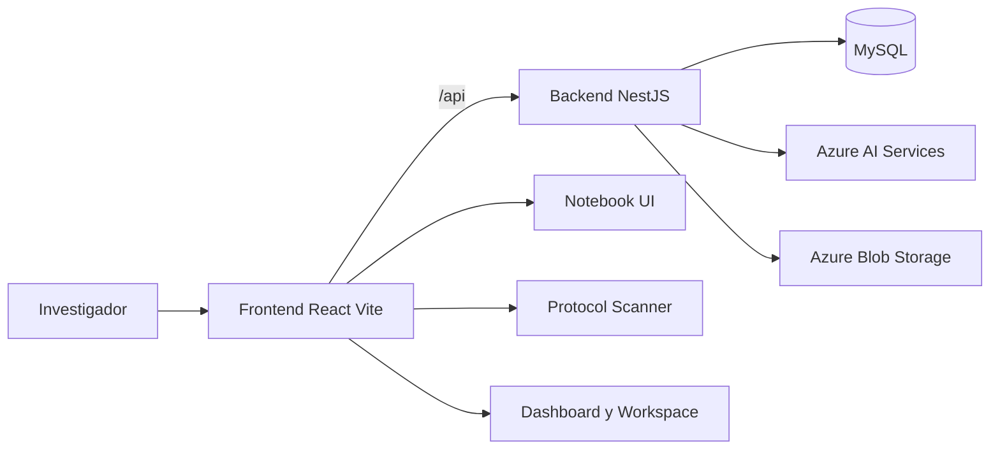
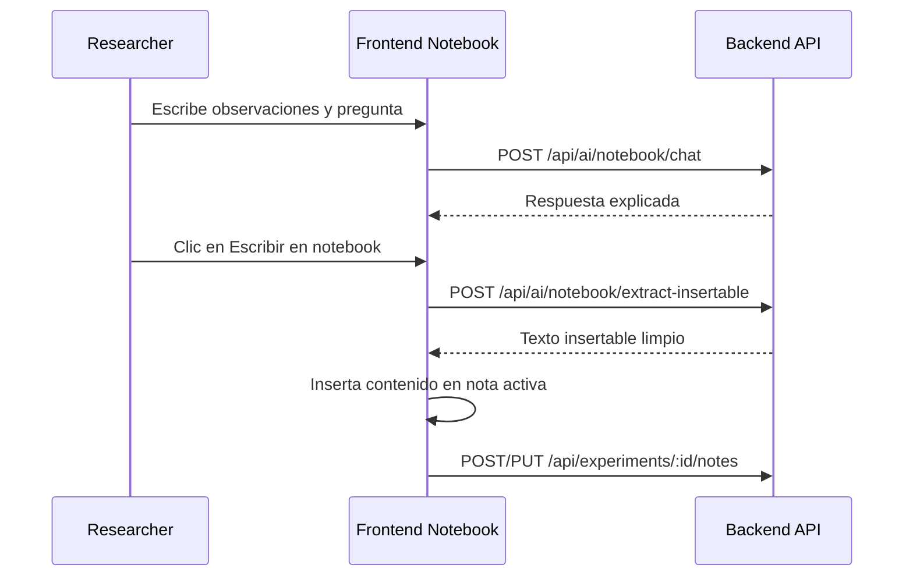
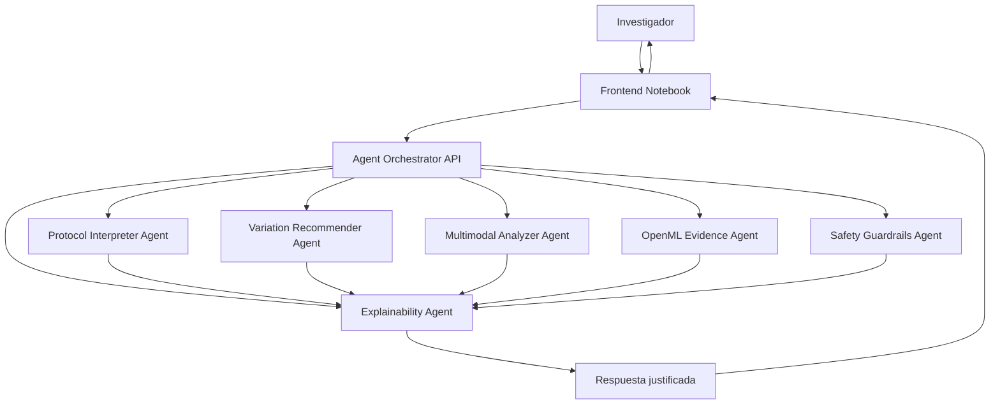
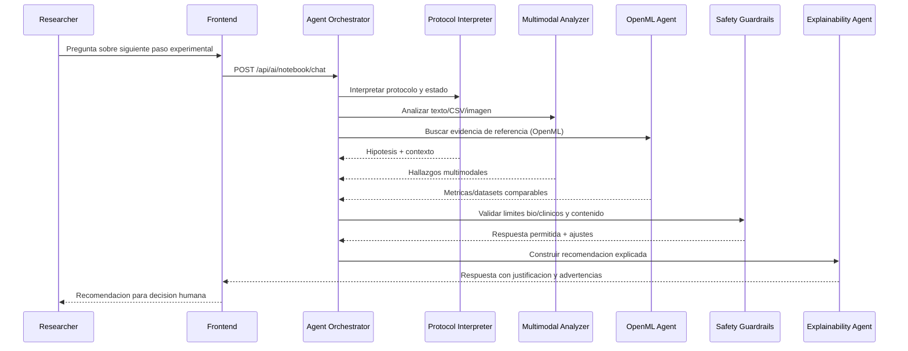
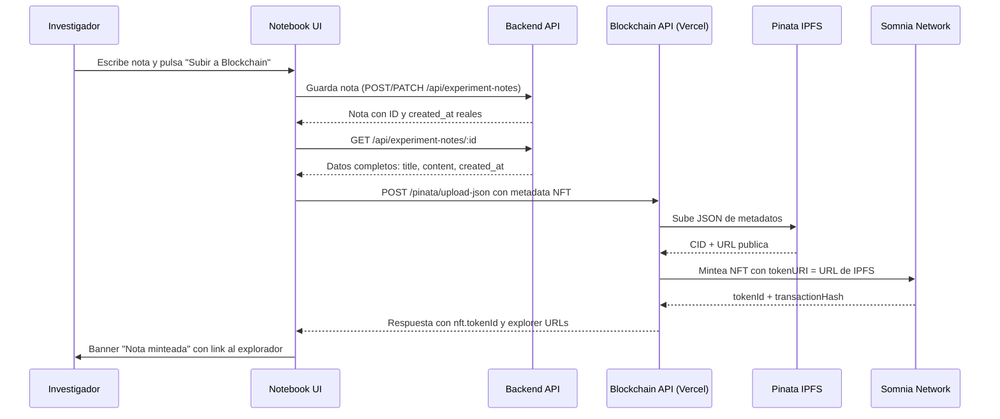

# Sapient Lab Frontend

[](https://react.dev/)
[](https://www.typescriptlang.org/)
[](https://vite.dev/)
[](https://azure.microsoft.com/)
[](https://www.microsoft.com/)

Frontend oficial de Sapient Lab para el reto Lab Notebook AI Assistant del Microsoft Innovation Challenge 2026.

Este cliente web permite a investigadores interactuar con un asistente de laboratorio orientado a explicabilidad, seguridad y soporte a decision cientifica, sin reemplazar el juicio humano.

## Challenge 2026 (resumen operativo)

El producto se disena para cumplir este objetivo del reto:

> Ayudar a investigadores a razonar sobre experimentos sin reemplazar su juicio cientifico,
> con un asistente basado en agentes que interprete protocolos, sugiera variaciones y analice
> resultados desde texto, CSV e imagenes, explicando por que recomienda cada paso.

En frontend esto se traduce en: interfaz de trabajo, trazabilidad de recomendaciones, flujo de insercion limpia al notebook y visibilidad de contexto para decisiones humanas.

## Objetivo del proyecto

Sapient Lab implementa una experiencia de notebook cientifico asistido por agentes para:

- Interpretar protocolos.
- Analizar resultados desde texto, CSV e imagen.
- Sugerir siguientes pasos con justificacion.
- Mantener controles de seguridad en dominios sensibles.

## Tecnologias

| Categoria | Stack |
|---|---|
| UI | React 19 + TypeScript |
| Build Tool | Vite 8 |
| Routing | react-router-dom |
| Animacion | framer-motion |
| Visual/UI libs | react-icons, lucide-react |
| Markdown | react-markdown, remark-gfm |
| Editor embebido | Monaco Editor |
| Integracion API | fetch + proxy Vite + interceptor de base URL |
| IA backend | Azure AI stack (via API backend) |
| Benchmark externo | OpenML (via backend `/api/openml/*`) |

## Alineacion con criterios del challenge

| Criterio de evaluacion | Implementacion en frontend |
|---|---|
| Explicabilidad | El chat muestra respuestas completas y el flujo de insercion al notebook separa contenido util de texto conversacional. |
| Seguridad | La interfaz consume endpoints con filtros y politicas server-side; evita exponer llaves y delega decisiones sensibles al backend. |
| Orquestacion de datos y modelos | El frontend integra notebook context, notas de experimento, documentos y servicios AI en un flujo unico. |
| Usabilidad para investigacion | Vistas de trabajo, scanner de protocolo, dashboard, tareas, equipo y recursos en una sola experiencia. |

## Arquitectura de alto nivel



## Flujo principal del notebook



## Como interactuan los agentes de IA

Diagrama de orquestacion funcional (vista frontend -> backend):



Diagrama de interaccion para una consulta real en notebook:



Este diseno mantiene al investigador en control y deja explicita la evidencia usada para cada sugerencia.

## OpenML en producto

El frontend consume OpenML de forma indirecta a traves del backend para enriquecer recomendaciones con benchmarks y metadata publica:

- descubrimiento de datasets relevantes,
- consulta de tareas y tipos de tarea,
- inspeccion de runs/evaluaciones,
- comparacion de medidas de desempeno.

La evidencia OpenML se incorpora a la respuesta explicada y no reemplaza el criterio cientifico del equipo.

## Modulos funcionales

- Landing y narrativa del producto: [src/landing](src/landing)
- Navegacion y layout: [src/components/layout](src/components/layout)
- Notebook inteligente: [src/pages/IntelligentLabNotebook.tsx](src/pages/IntelligentLabNotebook.tsx)
- Workspace de laboratorio: [src/pages/LabWorkspace.tsx](src/pages/LabWorkspace.tsx)
- Scanner de protocolos: [src/pages/ProtocolScanner.tsx](src/pages/ProtocolScanner.tsx)
- Dashboard, tareas, equipo y recursos: [src/pages](src/pages)
- Servicios API: [src/services](src/services)
- Estado global de proyecto y tema: [src/context](src/context)

## Estado funcional actual

| Modulo | Estado | Notas |
|---|---|---|
| Notebook inteligente | Activo | Chat con contexto + extraccion insertable + guardado/edicion/historial/eliminacion de notas por experimento. |
| Scanner de protocolo e imagen | Activo | Soporta texto, imagen y dictado de voz con fallback. |
| Onboarding de proyecto | Activo | Crea proyecto, define objetivo y sube documentos iniciales. |
| Equipo e invitaciones | Activo | Miembros, invitaciones pendientes y aprobacion/rechazo. |
| Biblioteca documental | Activo | Carga/listado/eliminacion de documentos por proyecto. |
| Chat documental en Resources | Activo | Consulta documental conectada a backend mediante `documentChat` y contexto de archivos cargados. |
| Auditabilidad Blockchain | Activo | Minteo de notas como NFT en Somnia Network via Pinata IPFS. Banner con link al explorador tras minteo exitoso. |

## Auditabilidad con Blockchain — Somnia Network

Sapient Lab integra un mecanismo de auditabilidad descentralizada que permite inmutable el registro de notas de experimento en la red **Somnia Shannon Testnet** mediante NFTs. Esto garantiza que cualquier investigador o auditor externo pueda verificar la existencia e integridad de un experimento sin depender de infraestructura centralizada.

### Por que blockchain

La investigacion cientifica requiere trazabilidad. Una nota guardada en una base de datos puede ser editada o eliminada sin dejar rastro. Al mintear el contenido de una nota como NFT en una blockchain publica:

- El hash del contenido queda sellado de forma permanente.
- La fecha de publicacion es verificable por cualquiera.
- El autor queda asociado al token sin necesidad de confianza en el servidor.
- Cualquier auditoria puede validar que el experimento existia en ese estado exacto.

### Flujo de uso



### Estructura del NFT minteado

Cada nota se convierte en un NFT ERC-721 con los siguientes metadatos:

```json
{
  "name": "<titulo de la nota>",
  "description": "<contenido completo de la nota>",
  "image": "https://moccasin-magnetic-gopher-766.mypinata.cloud/ipfs/bafybeiagdk4wzi4pz6sbzytf6w2b5kxj6idyex5lsuzkfcu7lngo6rinjm",
  "attributes": [
    { "trait_type": "ID",        "value": "EXP-{id}" },
    { "trait_type": "Usuario",   "value": "<nombre del investigador>" },
    { "trait_type": "Creado",    "value": "<fecha de creacion desde backend>" },
    { "trait_type": "publicado", "value": "<fecha de minteado>" }
  ]
}
```

Los datos de `name`, `description` y `Creado` se obtienen directamente del backend para garantizar que el contenido auditado coincide con lo almacenado en la base de datos, no con una version local del cliente.

### Infraestructura blockchain

| Campo | Valor |
|---|---|
| Red | Somnia Shannon Testnet |
| Contrato NFT | `0xE16EcfeE6067B4918AF3eAF09Dd134FFdaE92D4D` |
| Almacenamiento de metadatos | Pinata IPFS |
| Explorador de bloques | https://shannon-explorer.somnia.network |
| Auditar coleccion | https://shannon-explorer.somnia.network/token/0xE16EcfeE6067B4918AF3eAF09Dd134FFdaE92D4D |
| API Blockchain | https://backend-blockchain-sapiens-lab.vercel.app |

### Variable de entorno requerida

```env
VITE_API_BLOCKCHAIN=https://backend-blockchain-sapiens-lab.vercel.app
```

Esta variable debe estar presente en `.env.development` y `.env.production`.

### Endpoint consumido

```
POST {VITE_API_BLOCKCHAIN}/pinata/upload-json
```

Referencia completa del endpoint en [implementaci-n-de-pinata-IPFS/ENDPOINT_UPLOAD_JSON.md](../implementaci-n-de-pinata-IPFS/ENDPOINT_UPLOAD_JSON.md).

### UX del flujo de auditabilidad

1. El investigador redacta su nota en el **Notebook Inteligente**.
2. Pulsa el boton **"Subir a Blockchain"** junto a "Analizar texto".
3. El sistema guarda la nota en el backend, obtiene sus datos reales y construye el payload NFT.
4. Tras el minteo exitoso aparece un banner ambar con el enlace **"Auditar Notas →"** que apunta al contrato en el explorador de Somnia.
5. Cualquier persona con el link puede verificar el token y sus metadatos sin necesidad de acceso a la plataforma.

## Otras Funciones Implementadas

- Persistencia real de notas de experimento (crear y actualizar).
- Historial de notas por experimento en panel lateral.
- Eliminacion de notas desde historial.
- Titulo editable de nota y guardado con feedback de estado (`guardando`, `guardado`, `error`).
- Insercion de contenido util del asistente con `extract-insertable`.
- Analisis IA de nota con sugerencias y advertencias.

## Rutas principales

- /
- /login
- /onboarding
- /app
- /app/lab
- /app/protocolos
- /app/tareas
- /app/equipo
- /app/docs
- /app/reportes (redirige a /app)

Definidas en [src/App.tsx](src/App.tsx).

## Integracion con backend

El frontend usa dos mecanismos compatibles:

1. Proxy de Vite para /api en desarrollo (ver [vite.config.ts](vite.config.ts)).
2. Interceptor global de fetch que antepone VITE_API_URL cuando la URL inicia con /api/ (ver [src/main.tsx](src/main.tsx)).

Esto permite ejecutar localmente y desplegar en cloud sin cambiar el codigo de llamadas.

## Contrato API consumido por el frontend

### IA

- `GET /api/ai/providers/status`
- `POST /api/ai/conversation`
- `POST /api/ai/notebook/chat`
- `POST /api/ai/notebook/extract-insertable`
- `POST /api/ai/protocol/interpret`
- `POST /api/ai/results/analyze`
- `POST /api/ai/analyze-image`
- `POST /api/ai/document/analyze`
- `POST /api/ai/speech`
- `POST /api/ai/speech-to-text`
- `POST /api/ai/copilot/chat`
- `POST /api/ai/copilot/completions`
- `POST /api/ai/copilot/explain`

### Plataforma

- `POST /api/auth/login`
- `POST /api/auth/register`
- `POST /api/auth/forgot-password`
- `GET /api/projects`
- `POST /api/projects`
- `POST /api/projects/:id/join`
- `GET /api/projects/:id/members`
- `GET /api/projects/:id/invitations`
- `POST /api/projects/:id/invitations`
- `POST /api/projects/:id/invitations/:invitationId/accept`
- `POST /api/projects/:id/invitations/:invitationId/decline`
- `GET /api/experiments/:experimentId/notes`
- `POST /api/experiments/:experimentId/notes`
- `PUT /api/experiments/:experimentId/notes/:noteId`
- `DELETE /api/experiments/:experimentId/notes/:noteId`
- `POST /api/experiments/:experimentId/notes/:noteId/ai-suggestions`
- `GET /api/experiment-notes/by-experiment/:experimentId`
- `POST /api/experiment-notes`
- `PATCH /api/experiment-notes/:noteId`
- `GET /api/frontend/home`
- `GET /api/frontend/themes`
- `POST /api/frontend/metrics/counter-clicks/increment`

Nota: actualmente conviven rutas legacy (`/api/experiments/:experimentId/notes/*`) y rutas nuevas (`/api/experiment-notes/*`) en el flujo de notebook para mantener compatibilidad durante la transicion.

### Contexto de proyecto y documentos

- `GET /api/project-context/:projectId`
- `POST /api/project-context/:projectId/documents`
- `DELETE /api/project-context/:projectId/documents/:documentId`

### OpenML (nuevo recurso del challenge)

- `GET /api/openml/datasets`
- `GET /api/openml/datasets/qualities/list`
- `GET /api/openml/datasets/tag`
- `GET /api/openml/datasets/:id`
- `GET /api/openml/datasets/:id/features`
- `GET /api/openml/datasets/:id/qualities`
- `GET /api/openml/tasks`
- `GET /api/openml/tasks/types`
- `GET /api/openml/tasks/types/:id`
- `GET /api/openml/tasks/:id`
- `GET /api/openml/flows`
- `GET /api/openml/flows/exists`
- `GET /api/openml/flows/:id`
- `GET /api/openml/runs`
- `GET /api/openml/runs/:id`
- `GET /api/openml/runs/:id/trace`
- `GET /api/openml/evaluations`
- `GET /api/openml/evaluations/measures`
- `GET /api/openml/setups/:id`
- `GET /api/openml/studies`
- `GET /api/openml/studies/:id`

### Integraciones

- `POST /api/storage/upload`
- `GET /api/integrations/microsoft/status`
- `POST /api/integrations/microsoft/teams/test`

## Arquitectura de layout en aplicacion

La shell principal monta de forma simultanea:

- Sidebar izquierda con scanner de protocolos.
- Vista central de pagina activa.
- Panel derecho de analisis de datos.
- Panel adicional de herramientas IA.

Referencia: [src/components/layout/RootLayout.tsx](src/components/layout/RootLayout.tsx).

## Requisitos

- Node.js 18 o superior.
- npm 9 o superior.
- Backend Sapient Lab corriendo y accesible.

## Variables de entorno

Archivo recomendado para desarrollo: .env.development.

- VITE_API_URL: URL base del backend.
- VITE_API_TARGET: objetivo de proxy de Vite (opcional, recomendado en local).
- VITE_API_BLOCKCHAIN: URL del servicio blockchain para minteo de notas en Somnia Network.

Ejemplo:

```env
VITE_API_URL=http://localhost:3000
VITE_API_TARGET=http://localhost:3000
VITE_API_BLOCKCHAIN=https://backend-blockchain-sapiens-lab.vercel.app
```

## Instalacion y ejecucion

```bash
cd Frontend
npm install
npm run dev
```

Build de produccion:

```bash
npm run build
npm run preview
```

## Scripts disponibles

- npm run dev
- npm run build
- npm run preview
- npm run lint

## Instrucciones para jueces y evaluadores

### 1) Preparar entorno

1. Levantar backend en puerto 3000.
2. Configurar Frontend/.env.development con VITE_API_URL.
3. Ejecutar npm run dev en Frontend.

### 2) Escenario de demo recomendado (5-7 min)

1. Abrir landing y mostrar propuesta de valor.
2. Entrar a /app/lab y registrar una nota experimental.
3. Enviar una pregunta cientifica en el chat del notebook.
4. Mostrar respuesta explicada del asistente.
5. Usar Escribir en notebook para insertar solo contenido util.
6. Guardar nota y mostrar historial de notas.
7. Ir a scanner de protocolos para evidenciar soporte multimodal.
8. Abrir seccion de equipo para mostrar flujo de invitaciones.
9. Mostrar biblioteca documental y carga de archivos por proyecto.

### 3) Evidencias clave a observar

- El asistente no reemplaza al investigador, argumenta y sugiere.
- El contenido insertado en notebook evita texto conversacional de relleno.
- El flujo UI-API se mantiene estable incluso con errores de red (manejo de errores en servicios).

### 4) Alcance declarado para la evaluacion

- La experiencia critica de notebook, escaneo y colaboracion esta operativa.
- El chat documental en la pagina Resources esta en modo mock y se declara explicitamente para no sobreprometer funcionalidad.

## Estructura del proyecto

```text
Frontend/
  src/
    components/
    context/
    landing/
    pages/
    services/
    types/
    App.tsx
    main.tsx
  public/
  vite.config.ts
  package.json
```

## Calidad y mantenimiento

- Tipado fuerte en TypeScript.
- Separacion de UI, servicios y contexto.
- Capa de servicios centralizada para endpoints.
- Documentacion alineada al backend y a criterios de evaluacion del challenge.

## Notas de despliegue

- En desarrollo local, usar proxy y/o VITE_API_URL al backend local.
- En despliegue, configurar VITE_API_URL al endpoint publicado del backend.
- Mantener CORS habilitado para el origen del frontend en el backend.
